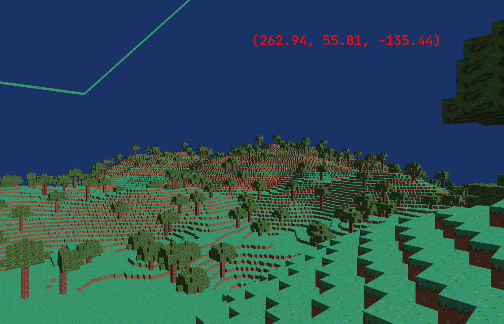

# Running

### Dependencies

- GLEW
- SDL2
- glm

For debian based distributions they are:
`libglew-dev libsdl2-dev libglm-dev`

Make sure you have SDL2 development libraries installed and then run the command bellow.   
`git clone "https://github.com/gbrls/myncraft/" && cd myncraft && make all`

# Game as of now

## How's the game now?
### Features
- Cool texures :)
- Infinite world.
- Cool player controls and a debug mode. 
- Trees!
### Missing features
- Loading chunks from disk.
- Collision.
- Water and other biomes.
- Clouds.
- the Sun & the Moon.
- Simulated voxel shadows.
## How's the game implemented?
### Working
- Chunck's meshes are generated from all the visible faces, hidden faces are not in the mesh.
	- It was initially a DFS that visited all visible faces, but it led to stack overflows.
	- Now, it is a refractored version of the DFS into a BFS.
- Terrain generation is deterministic: With the same seed you'll always get the exact same world.
	- This is implemented by using a perlin noise generator for everything, the terrain height and the tree generation.
	- The result of Perlin(x,y) is used as a seed to the tree generation algorithm.
- Block's faces have normals.
	- The normals are stored in the vertex data (in the mesh) as a sigle float, then it's transformed into a vector by the shader.
- Chunck's meshes are calculated in asynchronous calls.
	- Maybe it wasn't a good idea because it affects the main thread, in which the main game loop is running.
### Kinda/Not Working (Issues)
- Tree leaves are constrained by it's chunk, you can see that some trees have their leaves sliced.
- The meshing algorithm does not take into account chunk to chunk occlusion, every chunk has it's outter shell meshed.
- Camera coords to Chunk coords algorithm is not working properly.
- A async call to each chunk being genereted leads to a little lag to the main thread when a new chunk is generated.
	- This could be solved by having a single thread to handle the chunk generation.

# Progress
I usually write my code by expanding upon smaller functional iterations, so it's easy to document.

- [Day 0 (OpenGL "Hello World")](https://github.com/gbrls/myncraft/blob/4d16cab566b8c2e36e23c29ca5cf64d35191eda8/src/main.cpp)  
  

- [Day 1 (Minecraft "Hello Cube")](https://github.com/gbrls/myncraft/tree/48595563b984af3f6ec80cef53db212969c2136f)  

- Day 2.  
During this day I worked mostly on camera controls and projections, so the graphics didn't really changed.

- Day 3.  
I worked on mesh generation with a DFS to mesh only the visible faces.

- [Day 4](https://github.com/gbrls/myncraft/tree/13989dc41ad2b0b874482c4888649fb4aaf86e07)  
I changed the project structure a little bit and started messing around with terrain generation.  
  
  
Efficient mesh generation, but it's worse than greedy meshing.  

- [Day 5](https://github.com/gbrls/myncraft/tree/41265aacc674c7665069df5608533dee03ffbcdc)  
I implemented a texture array, instead of a single texture.  
A simple pause was implemented in order to take screenshots.  
A simple tree generation algorithm was implemented, currently the trees cannot occupy multiple chunks, this is a problem.
  

